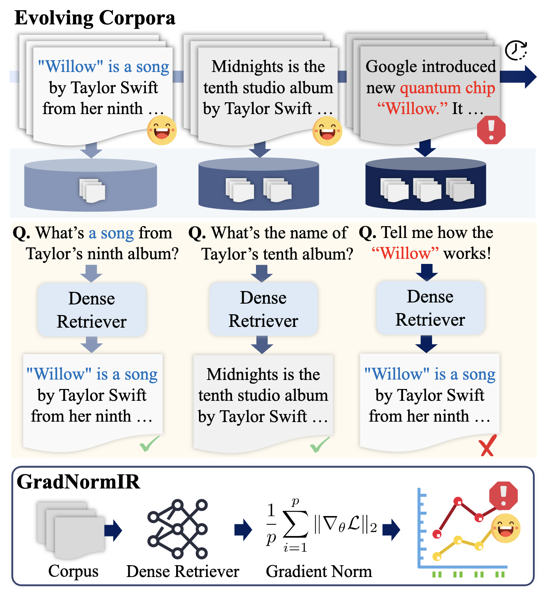

### Note ###

This is a repository for the paper **"When Should Dense Retrievers Be Updated? Detecting Out-of-Distribution Corpora Using GradNormIR"** accepted in **ACL 2025 Findings.**



#### Before starting.. 
You may disable updating the optimizer on the transformer/trainer. In the version of the transformer we used, modify the transformer/trainer.py 2350 line of code as follows:
```
                        else:
                            grad_norm = _grad_norm

                    #self.optimizer.step()
                    self.control = self.callback_handler.on_optimizer_step(args, self.state, self.control)
                    self._maybe_log_save_evaluate(tr_loss, grad_norm, model, trial, epoch, ignore_keys_for_eval)
```
---
#### Download BEIR
Download BEIR benchmark and select documents with at least related query from corpus.jsonl
```
save_root="datasets" # directory to save dataset
num_samples=3000 # The number of in-domain documents to randomly sample
python download_dataset.py \
   --save_root ${save_root} \
   --num_samples ${num_samples}
```
---
#### Pos & Neg Sampling

1. [**Save a vectorstore**](#1-save-a-vectorstore)  
   Save documents in a new corpus to a vectorstore.

2. [**Positive sampling**](#2-positive-sampling)  
   Run doc2doc retrieval by applying dropout for document query.

3. [**Negative sampling**](#3-negative-sampling)  
   Run doc2doc retrieval using positives as query.

4. [**Final selection**](#4-save-file)  
   Save a file of pos-neg pairs.


##### 1. Save a vectorstore
Save documents in a new corpus to a vectorstore.
```
data_root="datasets"
dataset_name="arguana"
model_repo="facebook"
model_name="contriever"
python vectorstore.py \
   --data_root ${data_root} \
   --dataset_name ${dataset_name} \
   --glob_dir "corpus_selected.jsonl" \
   --db_faiss_dir vectorstore/${model_name}/${dataset} \
   --batch_size 256 \
   --model_name ${model_repo}/${model_name} \
   --device cuda
```

##### 2. Positive sampling
Run doc2doc retrieval by applying dropout for document query.
```
python retriever_d2d_dropout.py  \
   --dataset_name ${dataset_name} \
   --data_root ${data_root} \
   --db_faiss_dir vectorstore/${model_name}/${dataset} \
   --save_root results/${model_name} \
   --model_name ${model_repo}/${model_name} \
   --dropout_rate 0.02 \
   --pooling mean
```

##### 3. Negative sampling
Run doc2doc retrieval using positives as the query.
```
# For sampling negatives
python retriever_d2d2d.py \
   --data_root ~/research/sds/src/datasets \
   --dataset_name arguana \
   --input_path results/contriever/d2d-retrieval-0.02.jsonl \
   --db_faiss_dir vectorstore/contriever/arguana 
   --model_name facebook/contriever

# For filtering positives from sampled negatives
python retriever_d2d.py \
   --dataset_name ${dataset_name} \
   --data_root ${data_root} \
   --db_faiss_dir vectorstore/${model_name}/${dataset} \
   --save_root results/${model_name} \
   --model_name ${model_repo}/${model_name} \
```

##### 4. Save file
Save a file containing positive-negative pairs.
```
# To get recall for each document
python retriever_q2d.py \
   --dataset_name ${dataset_name} \
   --data_root ${data_root} \
   --save_root results/${model_name}/${dataset_name} \
   --db_faiss_dir vectorstore/${model_name}/${dataset_name} \
   --model_name ${model_repo}/${model_name} 
python after_q2d_retrieval.py \
   --dataset_name ${dataset_name} \
   --model_name ${model_name} 
   

# Get pos & neg datasets
python after_d2d_retrieval.py \
   --data_root ~/research/sds/src/datasets \
   --dataset_name arguana \
   --db_faiss_dir vectorstore/${model_name}/${dataset} \
   --save_root results/${model_name} \
   --dropout 0.02 
```

---

#### GradNorm

1. [**Get GradNorm**](#1-get-gradnorm)  
   Compute each gradient norm value.

2. [**Calculate Metrics**](#2-cal-metric)  
   Calculate gradient norm.

##### Step in Detail

##### 1. Get GradNorm
Retrieve and calculate the GradNorm for use in your analysis.
```
$ cd ../gradnorm

# Get gradnorm
repo="facebook"
model_name="contriever"
pooling="mean"
dropout=0.02
temperature=0.05
port=8000
dataset_name="arguana"
data_root="../retrieval/results/${model_name}"


torchrun \
    --rdzv-backend=c10d \
    --rdzv-endpoint=localhost:${port} \
    run.py \
    --model_name_or_path ${repo}/${model_name} \
    --output_dir outputs \
    --train_data ${data_root}/${dataset_name}-${dropout}.json \
    --same_task_within_batch True \
    --sentence_pooling_method ${pooling} \
    --do_train False \
    --temperature ${temperature} \
    --logging_pth results/${model_name}/${dataset_name}-${dropout}
```

##### 2. Calculate metrics
Calculate gradient norms and DRR for the retrieval failure documents.

```
python metric.py \
   --model ${model_name} \
   --dataset ${dataset_name} \
   --dataset_fn ${data_root}/${dataset_name}-${dropout}.json \
   --gradnorm_fn results/${model_name}/${dataset_name}-${dropout}.json \
```
